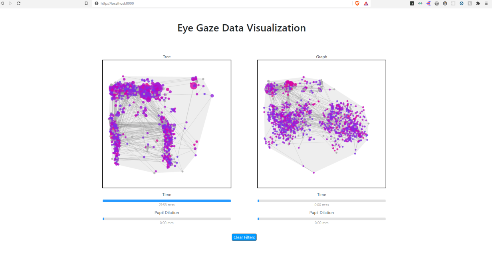

# CECS-450-Project-2

## Eye Gaze data visualization
The aim of this assignment is to show participant five's gaze in the form of visualization and answer following questions on the basis of visualization:

1. Did the user struggle more when searching or processing the given visual information?
2. Was the user more successful at completing the given task when using one visual support than the other?
3. How long was the user’s eyes were fixated at a particular point?
4. The goal of this assignment is to provide interactive visualization support to users who are interested in explorative activities, e.g. finding “interesting” things, examine the dataset by exploring whether a particular feature/trend/pattern is present, etc.

## Technology Used

* We used JavaScript'd d3 library for visualization along with Python for data processing. Python was chosen since it has modules like pandas, numpy which can be used for data manipulation i.e data preprocessing. So the list of modules used are:

1. Plotly
2. Pandas
3. Numpy
4. D3.js

## Team Members

* Apoorva Uppala
* Aishwarya Bhosale
* Keshav Bhojanapally
* Kelly Dang
* Kevin Reed

## How it looks

